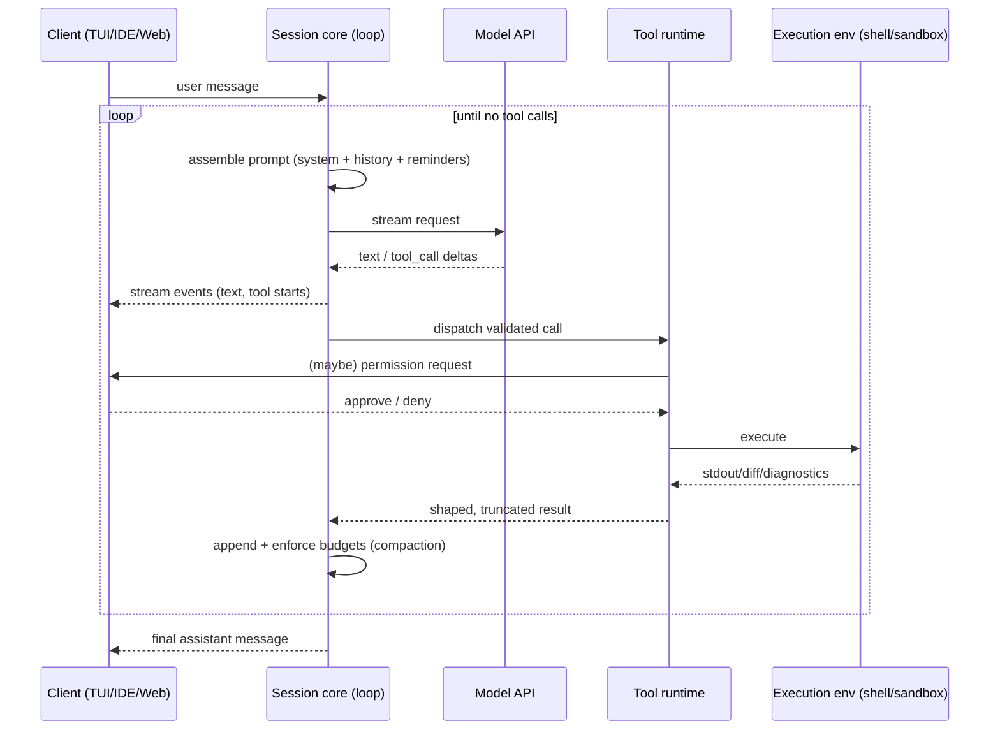

# Chapter 1 — Anatomy and Process Topologies

## 1.1 The irreducible core

Strip away UI, sandboxing, and persistence, and every coding agent in this workspace is the same ~15 lines:

```
history = [system_prompt, user_task]
loop:
    response  = llm(history, tool_schemas)      # streamed
    calls     = extract_tool_calls(response)
    if no calls:                                # model chose to stop
        return response.text
    for call in calls:
        check_permission(call)                  # maybe ask the human
        result = dispatch(call)                 # bash, edit, read, search…
        history.append(result)                  # truncated, sanitized
    enforce_budgets(history)                    # tokens, iterations, wall clock
```

Everything else in these nine repositories exists because each line of that pseudo-code hides a hard engineering problem:

| Pseudo-code line | Hidden problem | Chapter |
|---|---|---|
| `loop:` | termination, cancellation, mid-turn user input, retries | 2 |
| `llm(history, …)` | prompt layering, per-model prompts, cache discipline | 3 |
| `extract_tool_calls` | parsing across native/XML/text protocols | 3, 4 |
| `dispatch(call)` | registries, validation, truncation, parallelism | 4 |
| edit tools specifically | fuzzy patch application against stale model memory | 5 |
| bash tools specifically | persistent shells, sandbox policy, network egress | 6 |
| search/read tools | repo cognition without indexing the world | 7 |
| `history.append` / `enforce_budgets` | overflow, pruning, summarization, persistence | 8 |
| `check_permission` | rulesets, approvals, undo | 10 |

A useful mental model for the whole book: **the LLM is a stateless function**. Every piece of agent "memory," "planning," or "personality" is state that *your* runtime constructs and replays into that function on every single call. Coding-agent architecture is therefore mostly *state management* — which is why the projects here diverge most sharply not on prompts, but on **where state lives and which process owns it**.

## 1.2 The five subsystems

Across all five coding agents (Cline, opencode, Codex/Open Interpreter, SWE-agent, OpenHands) the same five subsystems appear, whatever the folder names:

1. **Session/state store** — the message history and its persistence. In-memory arrays (Cline's SDK), an event-sourced message log in SQLite (opencode), JSONL "rollout" files plus a state DB (Codex `codex-rs/core/src/state/`, `session/rollout_reconstruction.rs`), trajectory JSON on disk (SWE-agent), a server-side event store (OpenHands `openhands/app_server/event/`).
2. **The loop / turn engine** — Chapter 2.
3. **The tool runtime** — registry, schema, dispatch, result shaping. Chapter 4–5.
4. **The execution environment** — where side effects happen: host process, PTY, container, or OS sandbox. Chapter 6.
5. **The client(s)** — TUI, IDE extension, web UI — connected to the above by a protocol: gRPC in Cline (`apps/vscode/src/core/controller/grpc-handler.ts`), an HTTP/event server in opencode (`packages/opencode/src/server/`), a JSON app-server protocol in Codex (`codex-rs/app-server-protocol/`), REST + webhooks in OpenHands (`openhands/app_server/`).

The subsystem list is unremarkable. The architecture is in the *cuts* — which of these run in the same process, and what crosses the boundary between them.

## 1.3 Four process topologies

### Topology A — Embedded library (Cline SDK)

Cline's re-architecture (this clone; the pre-2025 extension was a monolith) extracts the agent into an embeddable SDK: `sdk/packages/agents/src/agent-runtime.ts` exposes `AgentRuntime`, a class you construct with a model provider, tools, and hooks, and call `run()` on. The VS Code extension, the CLI (`apps/cli`), and a hub/daemon (`sdk/packages/core/src/hub/`) are all *hosts* of the same runtime. **[Verified]**

- State: in-memory during a run; the host persists.
- Everything in one process; the host mediates UI and approvals via hook callbacks (`hooks.beforeTool`, `requestToolApproval` — `agent-runtime.ts:1216,1269`).
- Tradeoff: simplest to embed and test; process death loses in-flight state unless the host checkpoints; isolation is entirely the host's problem.

### Topology B — Local client/server with an event-sourced core (opencode)

opencode runs a server (`packages/opencode/src/server/`) owning sessions, tools, permissions, and an LSP client pool; the TUI (`packages/tui`, Go), desktop, and web clients speak to it over HTTP + an event bus (`src/bus/`). The defining decision: **the session loop re-derives its state from the persisted message log on every iteration** (Chapter 2.3), making the server restartable and the UI a pure subscriber. **[Verified]**

- Tradeoff: excellent crash recovery and multi-client support; every loop iteration pays a read-and-reconstruct cost; all execution is still on the user's machine.

### Topology C — Turn/task state machine over a submission queue (Codex / Open Interpreter 1.0)

`codex-rs/core` structures the agent as **tasks** processed against a **session**: a `RegularTask` (`core/src/tasks/regular.rs`) runs `run_turn` repeatedly; user input arriving mid-turn lands in an `input_queue` and is drained at the top of the next loop iteration (`core/src/session/turn.rs:227-235`) rather than interrupting the process. Clients (CLI/TUI, IDE plugins, the app server) communicate through a protocol crate. Execution is on-host but wrapped in OS sandboxes (Chapter 6). **[Verified]**

- Tradeoff: precise turn semantics (pending input, per-turn diffs via `turn_diff_tracker.rs`, per-turn token accounting) at the cost of the most intricate state machine in this workspace.

### Topology D — Agent inside the sandbox (OpenHands V1)

The strongest isolation stance here, and a reversal of the classic design. The classic (v1-book-era) OpenHands ran the agent on the server and shipped individual *actions* into a runtime container. In this clone, the **whole agent server runs inside the sandbox container**, and the app server is just an orchestrator:

- `openhands/app_server/sandbox/docker_sandbox_service.py:385-513` starts a container from an *agent-server image*, injects a per-sandbox `SESSION_API_KEY`, and sets a webhook callback URL (`http://host.docker.internal:<port>/api/v1/webhooks`) through which the agent posts events back. **[Verified]**
- Conversations are proxied to the sandboxed agent server; events are stored and re-streamed to the browser by the app server (`app_server/event/`, `event_callback/`). **[Verified]**
- The agent loop itself is in the external `openhands-sdk` package — not in this repo. **[Verified boundary; SDK internals External]**

- Tradeoff: a compromised or misbehaving agent is contained (it holds only its own session key, inside a container); but every user-visible byte crosses two hops, and local-filesystem workflows require mounts.

SWE-agent is a fifth data point but not a fifth topology: a batch CLI where the loop runs locally and *all* side effects go to a remote/containerized shell session through the SWE-ReX deployment abstraction (`sweagent/environment/swe_env.py:8-17`) — architecturally a degenerate case of D (execution remote, agent local) optimized for thousands of parallel benchmark runs. **[Verified]**

## 1.4 Choosing a topology

The decision usually reduces to three questions:

1. **Whose machine executes side effects?** If untrusted tasks or untrusted repos: D (or C's sandboxes as a compensating control). If the developer's own workflow: A or B.
2. **How many clients must observe one session?** More than one → B or D (server owns state). Exactly one, embedded → A.
3. **What must survive a crash?** If "the session, exactly" → B's event sourcing or D's server-side store. If "nothing much" → A.

Latency, the axis v1 emphasized, matters less than it appears: all four topologies are dominated by model inference time. The real cost of isolation is not round-trip time but *capability loss* — no IDE diagnostics, no user keychain, no local browser — which is why Chapter 7's repo-cognition techniques differ so much between IDE-resident and sandboxed agents.

## 1.5 Data flow (common to all topologies)



The interesting engineering is inside four of those arrows: *assemble prompt* (Ch. 3), *dispatch* (Ch. 4–5), *execute* (Ch. 6), and *enforce budgets* (Ch. 8).
